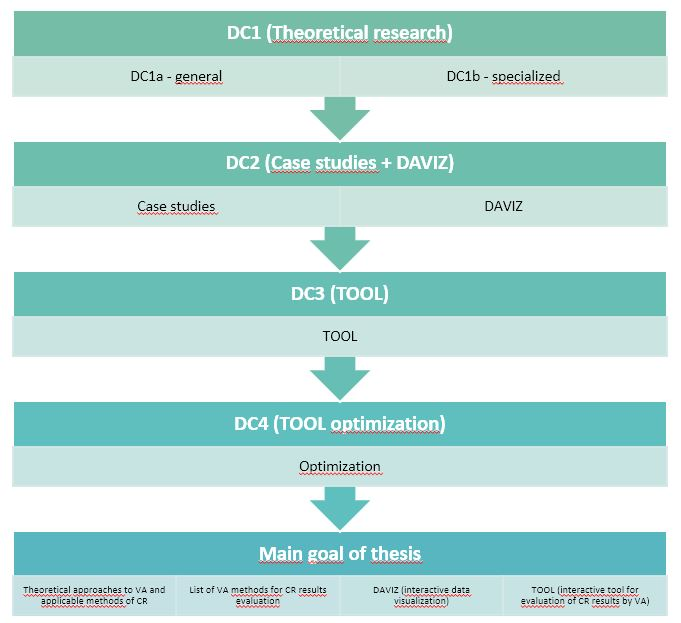
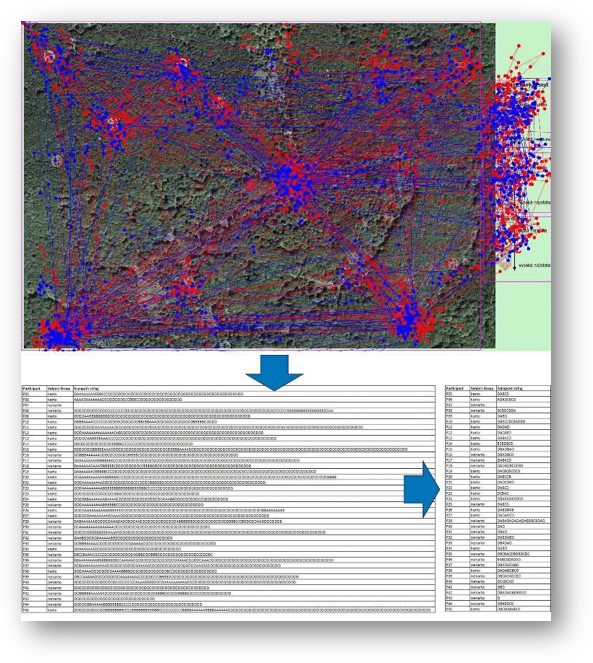
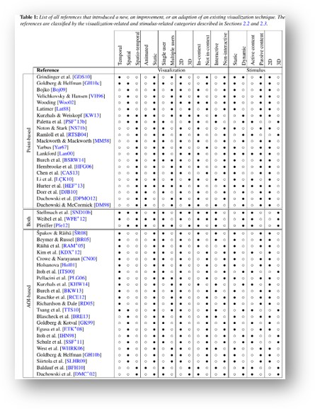
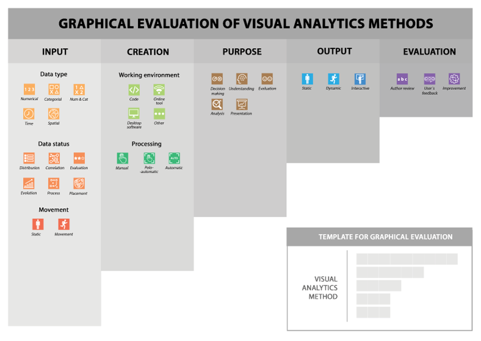
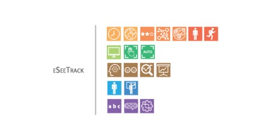

# Introduction

This is a simple presentation of ideas, **how to apply reproducibility in my current research connected to visual analytics in cognitive research.** This idea arises at PhD shool at Tartu 2019. 

_A reproducible paper ensures a reviewer or reader can recreate the computational workflow of a study or experiment, including the workflow of a study, computational process, including the prerequisite knowledge and the computational environment. Also, it requires a detailed description of the used software and data. What is one of the most important thing, both need to be openly available (Nüst et al, 2018)_

# Topic overview

In the case of PhD research, I work on dissertation thesis **Visual analytics in cognitive research**. With my supervisor prof. Vít Voženílek and scientific consultant dr. Alena Vondráková, we successfully set several partial goals connected to visual analytics, data visualization, infographics etc. 

**The main goal of this research is to apply selected and evaluated methods of visual analytics in a result of methods of cognitive research in cartography and GIS technologies.** Application of methods itself will be used after a series of testing during several case studies. In the end, according to results, it could be possible to create a fully interactive visual analytics tool for evaluating data from cognitive research.

The first partial goal is to **create a unique publication oriented to the theory of visual analytics**. In the region of Czechia does not exist any type of similar publication. According to the processing of historical evolution, actual trends and predictions to the future of visual analytics could be possible to single out potential usable methods entering research. 
The second partial goal is the **creation of case studies based on the application of visual analytics methods to the existing data set of eye-tracking data**. The result will contain a list of suitable methods for this usage. Also, the critical evaluation will be a part of this goal. 
The third goal will sum up all the achieved acknowledgement into an **interactive visual analytics tool**. The tool will be based on Javascript technology and should create data visualisation established on D3.js library.
The final goal is about **debugging and evaluation of the tool** itself. It will apply all achieved knowledge from theoretical and practical results. Evaluating process will lead to optimisation of created tool. 

Thanks to the elaboration of all partial research goals it will be possible to fulfil the main goal of the work and to publish a complex work describing the application of visual analysis in cognitive research not only in the field of cartography and geoinformation technologies. The work will include evaluation of visual analysis methods enriched with a wide range of practically applicable graphical outputs, whether in printed or digital form.

```{r, echo = FALSE, out.width="100%", fig.cap="Visual workflow of PhD thesis"}

```

# Reproducibility

## Working data

The main input for my data is eye-tracking testing. This technology produces mainly **spatial time-oriented data**. During the measuring process are eye-movement data collected in the database. The format of all datasets is the same, only stimulus in each project is different. During the measurement, time, position, movement is collected like an attribute to the final file.

Because of that is possible to apply this data like input for testing different methods of visual analytics tools. Research is focused mainly on data produced at Department of geoinformatics, Palacký University Olomouc. Previous eye-tracking testings had a different type of stimulus, inputs and research question otherwise their file format is the style the same. Because of that is a suitable example for planned case studies. 

```{r, echo = FALSE, out.width="100%", fig.cap="Data source"}

```

## Application of reproducibility

The issue of usage reproducibility in this current research could be very _tricky_. 

At the one hand, it is because of usage  current data inputs. All the data which I wanted to use was part of somebody else testing and research. In all cases **authors had to apply different kind of analysis** to extract some kind of information from given testing. 

On the other hand, **reproducibility is fully applied at research at all in some unique form**. Even though exactly the same data are not used like an input for the tool, tested visual analytics tool had been using some kind of similar type of data. Each of tested tool was described in some kind of scientific paper with several examples of usages. 

```{r, echo = FALSE, out.width="100%", fig.cap="Visual analytics methods"}

```

# Science communication _as a conclusion_

According to publishing this research to the scientific community, it very important to specify the goals of the potential application of reproducibility. In general, there is a way how to apply for this challenge into reality. Following Q&A should provide a clear description of the potential research. 

## What did you do?

Currently, I did almost nothing at all.
Nevertheless, I chose one particular part of my research which partly corresponding with the reproducibility. 
I **graphically evaluated methods of visual analytics tools** suitable for analyzing eye-tracking data. I designed a unique representative icon set, which easily describes crucial functionality and usage of visual analytics tools. Graphically is described as input and output, user interface, the object of analysis and potential evaluation. That is connected with other scientific researches. 

```{r, echo = FALSE, out.width="100%", fig.cap="Graphical evaluation template"}

```

## Why did you do it?

The main approach for creation of this graphical evaluation is **simplifying of the searching process according to finding suitable visual analytics tool for given research**. Visual materials provide the same information a thousand times faster than written text. In this case, the visual ranking is better to use. 

## What happened when you do it?

A **visual analytics tool will be graphically evaluated**, **long and boring descriptions will be eliminated**, **simple classification will be provided**. The searching process could be simplified and it could be easier to filter useless information. 

```{r, echo = FALSE, out.width="100%", fig.cap="Example of evaluated method"}

```

## What do the results mean in theory?

The graphical evaluation template **could provide a new look to description of different types of phenomena**. That could be the inspiration for another researcher from different scientific areas to create templates for describing similar tools in their areas of interest. 

## What do the results mean in practice?

According to my research, practically I will have **schematically and comprehensibly evaluated list of visual analytical tools**, which could be an input for my further case studies. I hope, the graphical evaluation also helps other researchers who're dealing with visual analytics, to simplify their research and open it to general public too.

## What is the key benefit for readers?

The key benefit of my methodology is a **fully convertible graphical template**, which **could be redesigned into a variety of topics** regarding scientific research. Otherwise, the main goal is providing a simple graphical evaluation of visual analytical tools, which means faster and better understanding of the topic.

## What remains unresolved?

Further research could be connected with **user evaluation** and **optimization** of a graphical template from researchers and the general public point of view. It will definitely bring some kind of improvement in terminology, the suitability of categorization and representation.

## Who is the reader?

The hardest task of all. Nowadays, I can not define concrete names who will gonna read my paper/research outputs. I can only prorovide names which I wish for enthusiastic readers.

- Prof. Vít Voženílek - my supevisor with really charger shedule

- Dr. Petr Kubíček - initiator of this type of research in Czechia

- Drs. Gennady Andrienko and Natalia Andrienko  - leading personalities in visual analytics

